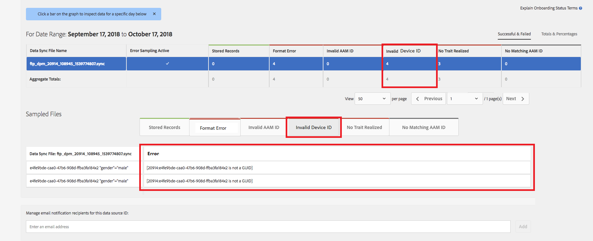

# 全域裝置ID驗證{#global-device-id-validation}

裝置廣告識別碼（即iDFA、GAID、Roku ID）具有必須符合的格式化標準，才能用於數位廣告生態系統。 現在，客戶和合作夥伴可以以任何格式將ID上傳至我們的Global [!UICONTROL data sources]，而不會收到ID格式正確的通知。 此功能將引入傳送至全域[!UICONTROL data sources]的裝置ID驗證，以取得正確的格式，並在ID格式錯誤時提供錯誤訊息。 我們將支援在啟動時驗證[!DNL iDFA]、[!DNL Google Advertising]和[!DNL Roku IDs]。

## 格式標準概述{#overview-of-format-standards}

以下是目前已識別並支援的全域裝置廣告IDAAM群組。 這些實作為共用[!UICONTROL Data Sources]實作，可供與這些平台的使用者關聯的資料搭配運作的任何客戶或資料合作夥伴使用。

<table>
  <tr>
   <td>平台 </td>
   <td>AAM資料來源ID </td>
   <td>ID格式 </td>
   <td>PIDAAM </td>
   <td>附註 </td>
  </tr>
  <tr>
   <td>Google Android(GAID)</td>
   <td>二零九一四年</td>
   <td>32十六進位數，通常顯示為8-4-4-12<em>範例，97987bca-ae59-4c7d-94ba-ee4f19ab8c21  </em> </td>
   <td>一三五二年</td>
   <td>此ID必須以原始／未雜湊／未變更的表單參考- <a href="https://play.google.com/about/monetization-ads/ads/ad-id/">https://play.google.com/about/monetization-ads/ads/ad-id/</a>收集</td>
  </tr>
  <tr>
   <td>Apple iOS(IDFA)</td>
   <td>二零九一五年</td>
   <td>32十六進位數，通常顯示為8-4-4-12 <em>範例，6D92078A-8246-4BA4-AE5B-76104861E7DC  </em> </td>
   <td>三五六零年</td>
   <td>此ID必須以原始／未雜湊／未變更的表單參考- <a href="https://support.apple.com/en-us/HT205223">https://support.apple.com/en-us/HT205223</a>收集</td>
  </tr>
  <tr>
   <td>羅庫（里達）</td>
   <td>郵編：121963</td>
   <td>32十六進位數，通常呈8-4-4-4-12 <em>範例，</em> <em> fcb2a29c-315a-5e6b-bcfd-d889ba19aada</em></td>
   <td>郵編：11536</td>
   <td>此ID必須以原始／未雜湊／未變更的表單參考- <a href="https://sdkdocs.roku.com/display/sdkdoc/Roku+Advertising+Framework">https://sdkdocs.roku.com/display/sdkdoc/Roku+Advertising+Framework</a>收集 </td>
  </tr>
  <tr>
   <td>Microsoft廣告ID(MAID)</td>
   <td>郵編：389146</td>
   <td>英數字串</td>
   <td>郵編：14593</td>
   <td>此ID必須以原始／未雜湊／未變更的表單參考- <a href="https://docs.microsoft.com/en-us/uwp/api/windows.system.userprofile.advertisingmanager.advertisingid">https://docs.microsoft.com/en-us/uwp/api/windows.system.userprofile.advertisingmanager.advertisingid</a> <a href="https://msdn.microsoft.com/en-us/library/windows/apps/windows.system.userprofile.advertisingmanager.advertisingid.aspx">https://msdn.microsoft.com/en-us/library/windows/apps/windows.system.userprofile.advertisingmanager.advertisingid.aspx</a>收集</td>
  </tr>
  <tr>
   <td>Samsung DUID</td>
   <td>郵編404660</td>
   <td>英數字串範例， 7XCBNROQJQPYW</td>
   <td>郵編：15950</td>
   <td>此ID必須以原始／未雜湊／未變更的表單參考- <a href="https://developer.samsung.com/tv/develop/api-references/samsung-product-api-references/productinfo-api">https://developer.samsung.com/tv/develop/api-references/samsung-product-api-references/productinfo-api</a>收集 </td>
  </tr>
</table>

## 在應用程式{#setting-an-advertising-identifier-in-the-app}中設定廣告識別碼

在應用程式中設定廣告商ID實際上是兩個步驟，先擷取廣告商ID，然後傳送至Experience Cloud。 執行這些步驟的連結如下。

1. 擷取ID
   1. [!DNL Apple] 有關此處 [!DNL advertising ID] 的資訊 [可找到](https://developer.apple.com/documentation/adsupport/asidentifiermanager)。
   1. 有關為[!DNL Android]開發人員設定[!DNL advertiser ID]的部分資訊，請參閱[HERE](http://www.androiddocs.com/google/play-services/id.html)。
1. 使用SDK中的[!DNL setAdvertisingIdentifier]方法，將它傳送至Experience Cloud
   1. 使用`setAdvertisingIdentifier`的資訊在[說明檔案](https://aep-sdks.gitbook.io/docs/using-mobile-extensions/mobile-core/identity/identity-api-reference#set-an-advertising-identifier)中，適用於[!DNL iOS]和[!DNL Android]。

`// iOS (Swift) example for using setAdvertisingIdentifier:`
`ACPCore.setAdvertisingIdentifier([AdvertisingId]) // ...where [AdvertisingId] is replaced by the actual advertising ID`

## 錯誤ID {#dcs-error-messaging-for-incorrect-ids}的DCS錯誤訊息

當將不正確的全域裝置ID（IDFA、GAID等）即時提交至Audience Manager時，點擊時會傳回錯誤碼。 以下是傳回錯誤的範例，因為ID會以[!DNL Apple IDFA]的形式傳入，其中應僅包含大寫字母，但ID中有小寫&#39;x&#39;。

請參閱[documentation](https://experienceleague.adobe.com/docs/audience-manager/user-guide/api-and-sdk-code/dcs/dcs-api-reference/dcs-error-codes.html?lang=en#api-and-sdk-code)以取得錯誤碼清單。

## 上線全域裝置ID {#onboarding-global-device-ids}

除了即時提交全域裝置ID外，您也可以針對ID「[!DNL onboard]」（上傳）資料。 此程式與您針對客戶ID上線資料（通常透過金鑰／值配對）時的程式相同，但您只需使用適當的資料來源ID，即可將資料指派給全域裝置ID。 有關上線程式的文檔可在[documentation](https://experienceleague.adobe.com/docs/audience-manager/user-guide/implementation-integration-guides/sending-audience-data/batch-data-transfer-process/batch-data-transfer-overview.html?lang=en#implementation-integration-guides)中找到。 請記得使用全域[!UICONTROL data source] ID，視您使用的平台而定。

如果在上線程式中提交了不正確的全域裝置ID，則[[!DNL Onboarding Status Report]](https://experienceleague.adobe.com/docs/audience-manager/user-guide/reporting/onboarding-status-report.html?lang=en#reporting)中會顯示錯誤。

以下是該報表中可能出現的錯誤範例：

