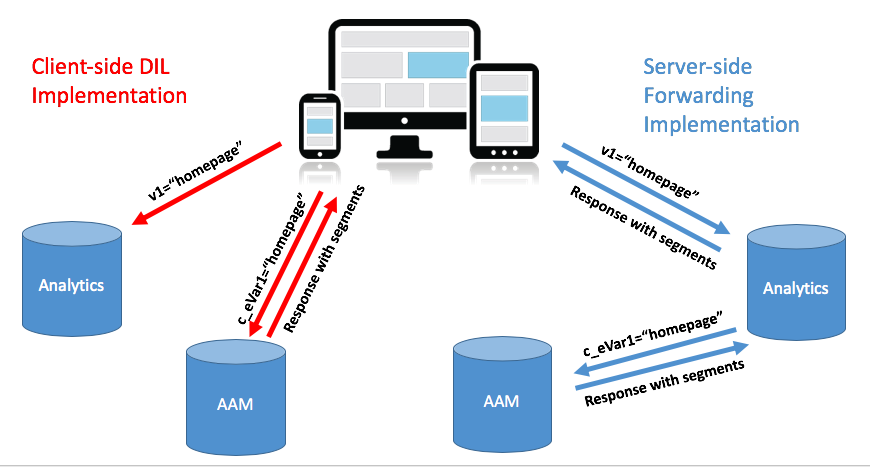
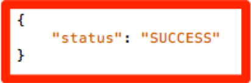

# 將您網站的AAM實作從[!DNL Client-Side] DIL移轉至[!DNL Server-Side Forwarding] {#migrating-your-site-s-aam-implementation-from-client-side-dil-to-server-side-forwarding}

如果您同時擁有Adobe Audience Manager(AAM)和Adobe Analytics，而且您目前使用「DIL」([!DNL Data Integration Library])程式碼從頁面傳送點擊至AAM，並且也將點擊從頁面傳送至Adobe Analytics，則本教學課程適用於您。 由於您同時擁有這兩種解決方案，而且這兩種解決方案都屬於Adobe Experience Cloud，因此您有機會遵循開啟「[!DNL Server-Side Forwarding](SSF)」的最佳實務，這可讓[!DNL Analytics]資料收集伺服器即時將網站分析資料轉送至Audience Manager，而不需讓[!DNL client-side]程式碼從頁面傳送額外點擊至AAM。 本教程將引導您完成將交換機從舊的&quot;[!DNL Client-Side DIL]&quot;實現轉換到較新的&quot;[!DNL Server-Side forwarding]&quot;方法的步驟。

## [!DNL Client-Side] (DIL)與  [!DNL Server-Side] {#client-side-dil-vs-server-side}

比較這兩種將Adobe Analytics資料匯入AAM的方法並加以比較時，首先可能會有助於在下列影像中呈現差異：

### [!DNL Client-side] DIL實作  {#client-side-dil-implementation}

如果您使用此方法將Adobe Analytics資料匯入AAM，表示您的網頁有兩個點擊：一個會前往[!DNL Analytics]，另一個會前往AAM（在複製網頁上的[!DNL Analytics]資料後）。 [!UICONTROL Segments] 會從AAM傳回至頁面，供其用於個人化等。這被視為「舊版」實作，不再建議使用。

除了未遵循最佳實務外，使用此方法的缺點包括：

* 來自頁面的兩次點擊，而非僅一次
* [!UICONTROL Server-Side Forwarding] 是AAM觀眾即時分享的必要條件 [!DNL Analytics]，因 [!DNL Client-side] 此實作不允許此功能（未來可能還有其他功能）

建議您移至AAM實作的[!UICONTROL Server-Side Forwarding]方法。

### [!UICONTROL Server-Side Forwarding] 實施 {#server-side-forwarding-implementation}

如上圖所示，點擊來自網頁至Adobe Analytics。 [!DNL Analytics] 然後即時將該資料轉送至AAM，並評估訪客至AAM [!UICONTROL traits] 和 [!UICONTROL segments]，就像點擊是直接從頁面產生。

[!UICONTROL Segments] 會在相同的即時點擊中傳回， [!DNL Analytics]將回應轉送至網頁以進行個人化等。

移至伺服器端轉送不會造成時間上的不便。 我們強烈建議同時擁有Audience Manager和[!DNL Analytics]的任何人都使用此實作方法。

## 您有兩個主要任務{#you-have-two-main-tasks}

這個網頁上有很多資訊，當然，這都很重要。 但是，**可歸結為您需要執行的兩項主要工作：**

1. 將您的程式碼從[!DNL Client-Side] DIL程式碼變更為[!UICONTROL Server-Side Forwarding]程式碼
1. 在[!DNL Analytics] [!DNL Admin Console]中翻動交換機以啟動資料的實際轉發（每[!UICONTROL report suite]）

如果跳過其中任一步驟，SSF將無法正常工作。 步驟和其他資料已新增至本檔案，以協助您正確執行這兩個步驟以進行設定。

## 實施選項{#implementation-options}

當您從[!DNL client-side]移至[!DNL server-side]時，您要執行的其中一項工作是將程式碼變更為新的[!UICONTROL Server-Side Forwarding]程式碼。 這是使用下列其中一個選項來完成：

* Adobe Experience Platform Launch —— 我們針對網頁屬性建議的實作選項。 您將會看到，這是一項非常簡單的工作，因為[!DNL Launch]已為您完成了所有艱難的工作。
* 在頁面上——如果您尚未（目前）使用Adobe Launch，您也可以將新的SSF程式碼直接放入[!DNL appMeasurement.js]檔案的`doPlugins`函式中
* 其他標籤管理器——這些標籤可以視為與上一個（在頁面上）選項一樣，因為您仍會將SSF代碼放在`doPlugins`中，而其他標籤管理器則儲存[!DNL AppMeasurement]代碼

我們將在「更新程式碼」區段中檢視以下各項。

## 實施步驟 {#implementation-steps}

### 步驟0:先決條件：Experience Cloud ID服務(ECID){#step-prerequisite-experience-cloud-id-service-ecid}

移至[!UICONTROL Server-Side Forwarding]的主要先決條件是要實作Experience Cloud ID服務。 如果您使用Experience Platform Launch，這最容易做到，在此情況下，您只需安裝ECID擴充功能，就可完成其他工作。

如果您使用非Adobe TMS或完全沒有TMS，請實作ECID以在&#x200B;**之前執行**。 如需詳細資訊，請參閱[ECID檔案](https://marketing.adobe.com/resources/help/en_US/mcvid/)。 唯一的先決條件是有關程式碼版本，因此，只要在下列步驟中套用最新版本的程式碼，您就沒問題。

>[!NOTE]
>
>在實施之前，請閱讀本整份檔案。 下方的「計時」一節包含有關您應實作每件作品的&#x200B;*重要資訊，包括ECID（如果尚未實作）。*

### 步驟1:從DIL代碼{#step-record-currently-used-options-from-dil-code}記錄當前使用的選項

當您準備從[!DNL Client-Side] DIL程式碼移至[!UICONTROL Server-Side Forwarding]時，第一步就是識別您使用DIL程式碼所做的一切，包括自訂設定和傳送至AAM的資料。 需要注意和考慮的事項包括：

* 使用[!DNL siteCatalyst.init] DIL模組的一般[!DNL Analytics]變數——您不必擔心這個變數，因為其工作只是傳送一般的[!DNL Analytics]變數，而且只要啟用SSF即可。
* 合作夥伴子網域——在DIL.create函式中，記下`partner`參數。 這稱為「合作夥伴子網域」，有時稱為「合作夥伴ID」，當您放置新的SSF代碼時，將會需要它。
* [!DNL Visitor Service Namespace] -也稱為「[!DNL Org ID]」或「[!DNL IMS Org ID]」，當您設定新的SSF代碼時，也需要這個選項。記下來。
* containerNSID、uuidCookie和其他進階選項——記下您使用的任何其他進階選項，以便您也能在SSF程式碼中設定這些選項。
* 其他頁面變數——如果其他變數是從頁面傳送至AAM（除了由siteCatalyst.init處理的一般[!DNL Analytics]變數外），您需要記下這些變數，以便透過SSF傳送(擾動程式警報：透過[!DNL contextData]變數)。

### 步驟2:更新代碼{#step-updating-the-code}

在上述「實作選項」一節中，會針對您實作[!UICONTROL Server-Side Forwarding]的方式／位置提供多個選項。 為了讓本節有效，我們必須將其分為以下幾節（其中兩節合併）。 請至本節最能說明您需求的方法。

#### Adobe Experience Platform Launch {#launch-by-adobe}

觀看以下影片，瞭解如何在Experience Platform Launch中將實施選項從[!DNL Client-Side] DIL程式碼移至[!UICONTROL Server-Side Forwarding]。

>[!VIDEO](https://video.tv.adobe.com/v/26310/?quality=12)

#### 「On the Page」或「Non-Adobe Tag Manager {#on-the-page-or-non-adobe-tag-manager}」

觀看以下影片，瞭解如何將實作選項從[!DNL Client-Side] DIL程式碼移至[!DNL AppMeasurement]程式碼中的[!UICONTROL Server-Side Forwarding]，這些選項位於檔案中或非Adobe標籤管理系統中。

>[!VIDEO](https://video.tv.adobe.com/v/26312/?quality=12)

### 步驟3:啟用轉發（每[!UICONTROL Report Suite]）{#step-enabling-the-forwarding-per-report-suite}

在本教學課程中，我們一直致力於將程式碼從[!DNL Client-Side DIL]程式碼切換至[!UICONTROL Server-Side Forwarding]。 這沒關係，因為那是比較難的部分。 雖然您會看到本節非常簡單，但與更新程式碼一樣重要。 在此影片中，您將瞭解如何切換開關，以啟用將資料從Analytics轉送至Audience Manager的實際功能。

>[!VIDEO](https://video.tv.adobe.com/v/26355/?quality-12)

**注意：** 如影片所述，請記住，在Experience Cloud後端完全啟用轉送功能需要4小時。

## 計時{#timing}

提醒您，從[!DNL Client-Side DIL]移至[!UICONTROL Server-Side Forwarding]有兩個主要工作：

1. 更新程式碼
1. 在[!DNL Analytics] [!DNL Admin Console]中翻轉交換機

但問題是，你先做哪一個？ 重要嗎？ 好，抱歉，有兩個問題。 但答案是……它取決於，是的，它&#x200B;*可以*。 這樣很模糊，又如何？ 讓我們來劃分。 但首先，如果您是擁有大量網站的大型組織，還會出現另一個問題：我必須一次做所有事嗎？ 那個比較容易。 不。 你可以一件件地做，差不多。:)

### 深入探討{#a-little-deeper-dive}

時間和順序問題的原因在於轉發*實際*如何運作，這可概括為以下幾個技術事實：

* 如果您已實作Experience Cloud ID服務(ECID)，而[!DNL Analytics] [!DNL Admin Console](&quot;the switch&quot;)中的開關已開啟，資料會從[!DNL Analytics]轉送至AAM，即使您尚未更新程式碼亦然。
* 如果沒有實作ECID，即使您已開啟切換器，而且有SSF代碼，資料也不會轉送。
* SSF代碼（無論在[!DNL Launch]中還是在頁面上）確實會處理響應，當然，完成遷移是必需的。
* 請記住，SSF交換機由[!UICONTROL Report Suite]啟用，但代碼由[!DNL Launch]中的屬性處理，或由[!DNL AppMeasurement]檔案處理（如果您不使用[!DNL Launch]）

### 最佳實務 {#best-practices}

根據這些技術細節，以下是有關「何時該做什麼」時機的建議：

#### 如果您尚未實作ECID {#if-you-do-not-have-ecid-yet-implemented}

1. 針對要為SSF啟用的每個[!UICONTROL report suite]，在[!DNL Analytics]中翻轉交換機

   1. 轉送尚未開始，因為您沒有ECID

1. 請依據網站將程式碼從[!DNL Client-Side DIL]更新為SSF（此程式碼可能位於[!DNL Launch]中，或在頁面上，如上節所述）

   1. 轉送功能現在會流動（如您已新增ECID），您也應該收到對[!DNL Analytics]信標的正確JSON回應（如需詳細資訊，請參閱下方的驗證與疑難排解一節）

#### 如果您已實作ECID {#if-you-do-have-ecid-implemented}

1. 準備並規劃，以便您準備好將程式碼從DIL更新為SSF PER [!UICONTROL report suite]，以便為SSF啟用：

   1. 在[!DNL Analytics]中翻轉交換機以啟用SSF

      1. 轉發將啟動，因為您已啟用ECID
   1. 盡快將代碼從[!DNL Client-Side DIL]更新為SSF（此代碼可能位於[!DNL Launch]或頁面上，如上節所述）

      1. 您應該會收到對[!DNL Analytics]信標的正確JSON回應（如需詳細資訊，請參閱下方的驗證與疑難排解一節）

**注意1:** 請務必盡可能接近這兩個步驟，因為在上述步驟1和2之間，您將會有重複的資料傳入AAM。換言之，SSF將開始從[!DNL Analytics]傳送資料至AAM，而且由於DIL程式碼仍在頁面上，因此也會有點擊從頁面直接傳入AAM，因此資料倍增。 當您將程式碼從DIL更新至SSF時，就會有所緩解。

**注2：如** 果您寧願在資料上稍微有差異，也不願在資料上稍微重複一下，您可以切換上述步驟1和2的順序。將程式碼從DIL移至SSF將會停止資料流入AAM，直到您能夠翻轉交換機以開啟[!UICONTROL report suite]的SSF。 通常，客戶寧願將資料加倍一小部分，也不要錯過讓訪客進入[!UICONTROL traits]和[!UICONTROL segments]的機會。

#### 有多個站點和[!UICONTROL Report Suites] {#migration-timing-when-you-have-many-sites-and-report-suites}時的遷移時間

本主題在前幾節中簡要介紹，主要策略可概括如下：

一次遷移一個站點/[!UICONTROL report suite]（或一組站點/[!UICONTROL report suites]）。

不過，這可能會因為幾個可能的情況而變得有些棘手：

* 您的網站包含數個不同的[!UICONTROL report suites]
* 您有一個[!UICONTROL report suite]，其中包含數個網站（例如全域[!UICONTROL report suite]）
* 您使用一個[!DNL Launch]屬性來覆蓋數個網站
* 您有不同的開發團隊，負責不同的網站

因為有了這些項目，它會變得有些複雜。 我能建議的最好事情是：

* 請花點時間，根據上述說明制定移轉至SSF的策略
* 根據[!DNL Launch]（或單個[!DNL AppMeasurement]檔案）中的單個屬性通常映射到1或2個不同[!UICONTROL report suites]的事實，您可能可以逐個制定適用於這些不同組的計畫，將企業更新為SSF
* 如果您正在與Adobe Consulting合作，請與他們討論有關您的移轉計畫，以便他們能夠視需要提供協助

## 驗證和疑難排解{#validation-and-troubleshooting}

驗證[!UICONTROL Server-Side Forwarding]是否已啟動並正在執行的主要方式，是查看您對應用程式中任何Adobe Analytics點擊的回應。

如果您未從[!DNL Analytics]將資料[!UICONTROL server-side forwarding]傳送至Audience Manager，則對[!DNL Analytics]信標（除2x2像素外）的回應將不會。 不過，如果您正在執行SSF，則有些項目可在[!DNL Analytics]請求和回應中驗證，讓您知道[!DNL Analytics]正在與Audience Manager正確通訊、轉送點擊並取得回應。

>[!VIDEO](https://video.tv.adobe.com/v/26359/?quality=12)

**警告：** 小心錯誤的「成功」 —— 如果有回應，而且一切似乎都正常運作，請確定回應中包含「內容」物件。如果您不這麼做，您可能會看到訊息顯示[!DNL "status":"SUCCESS"]。 雖然這聽起來很瘋狂，但這實際上證明它無法正常運作。 如果您看到這一點，表示您已完成[!DNL Launch]或[!DNL AppMeasurement]中的程式碼更新，但[!DNL Analytics] [!DNL Admin Console]中的轉送尚未完成。 在這種情況下，您需要驗證是否已在[!DNL Analytics] [!DNL Admin Console]中為[!UICONTROL report suite]啟用SSF。 如果您已經有，而且還沒有4小時，請耐心等待，因為在後端進行所有必要的變更可能需要這麼長時間。

有關[!UICONTROL Server-Side Forwarding]的更多資訊，請參閱[檔案](https://marketing.adobe.com/resources/help/en_US/reference/ssf.html)。
