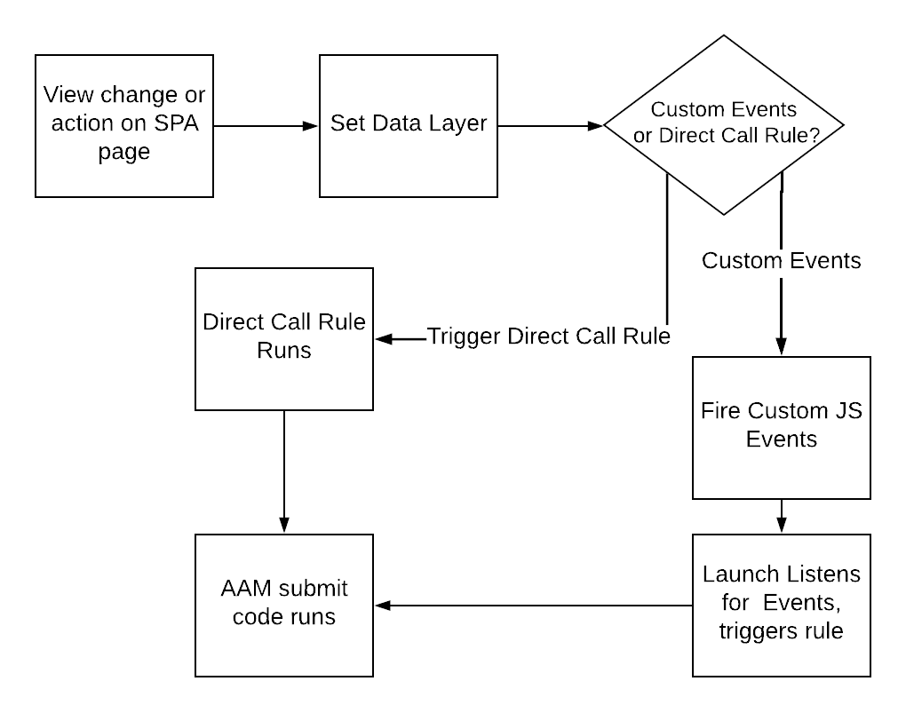

# 將資料傳送至SPA時，請在AAM頁面上使用最佳實務 {#using-best-practices-on-spa-pages-when-sending-data-to-aam}

本檔案說明將資料從單頁應用程式(SPA)傳送至Adobe Audience Manager (AAM)的幾個最佳實務。 本文章著重於使用 [!UICONTROL Experience Platform tags]，此為建議的實作方法。

## 初始備註

* 以下專案假設您正使用Platform標籤在您的網站上實作。 如果您未使用Platform標籤，但這些考量事項仍會存在，但您需要根據實作方法調整。
* 所有SPA並不相同，因此您可能需要調整下列部分專案以最符合您的需求，但Adobe想要分享一些您從SPA頁面傳送資料至Audience Manager時需要考慮的最佳實務。

## 在Experience Platform標籤（前身為Launch）中使用SPA和AAM的簡圖{#simple-diagram-of-working-with-spas-and-aam-in-experience-platform-launch}

>[!NOTE]
>如前所述，這是一個簡化的圖表，說明如何使用Platform標籤在Adobe Audience Manager實作(不含Adobe Analytics)中處理SPA頁面。 如您所見，這是相當直截了當的決定，其中最重大的決定在於您要如何將檢視變更（或動作）傳達給Platform標籤。

## 從SPA頁面觸發標籤 {#triggering-launch-from-the-spa-page}

在Platform標籤中觸發規則(以及因此將資料傳送至Audience Manager)的兩個較常見方法是：

* 設定JavaScript自訂事件 [此處](https://helpx.adobe.com/analytics/kt/using/spa-analytics-best-practices-feature-video-use.html) 使用Adobe Analytics)
* 使用 [!UICONTROL Direct Call Rule]

在此Audience Manager範例中，您會使用 [!UICONTROL Direct Call rule] 在Platform標籤中，觸發進入Audience Manager的點選。 如同您將在下一節所見，透過設定 [!UICONTROL Data Layer] 至新值，以便 [!UICONTROL Data Element] 在Platform標籤中。

## 示範頁面 {#demo-page}

以下是一個小頁面，示範如何變更資料層中的值並將其傳送到Audience Manager中(您可能在SPA頁面上這麼做)。 此功能可建立模型，以因應更詳細的所需變更。 您可以找到此示範頁面 [此處](https://aam.enablementadobe.com/SPA-Launch.html).

## 設定資料層 {#setting-the-data-layer}

如前所述，在頁面上載入新內容或有人在網站上執行動作時，資料層需要在頁面標題中動態設定，之後才會呼叫並執行Platform標籤 [!UICONTROL rules]，以便Platform標籤能從資料層擷取新值，並將它們推送到Audience Manager中。

如果您前往上述示範網站並檢視頁面來源，您將會看到：

* 資料層位於頁面前端，在呼叫Platform標籤之前
* 模擬SPA連結中的JavaScript會變更 [!UICONTROL Data Layer]，然後呼叫Platform標籤( `_satellite.track()` 呼叫)。 如果您是使用JavaScript自訂事件，而不是這個 [!UICONTROL Direct Call Rule]，則課程相同。 首先變更 [!DNL data layer]，然後呼叫Platform標籤。

>[!VIDEO](https://video.tv.adobe.com/v/23322/?quality=12)

## 其他資源 {#additional-resources}

* [Adobe論壇上的SPA討論](https://forums.adobe.com/thread/2451022)
* [Reference Architecture網站說明如何在Platform標籤中實作SPA](https://helpx.adobe.com/experience-manager/kt/integration/using/launch-reference-architecture-SPA-tutorial-implement.html)
* [在Adobe Analytics中追蹤SPA時使用最佳實務](https://helpx.adobe.com/analytics/kt/using/spa-analytics-best-practices-feature-video-use.html)
* [用於本文的示範網站](https://aam.enablementadobe.com/SPA-Launch.html)
